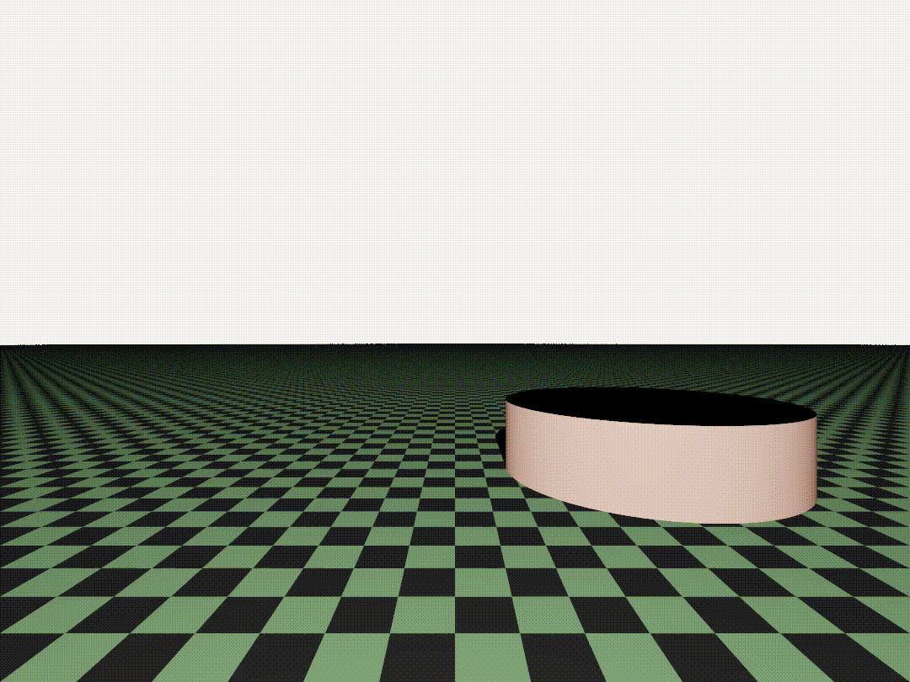

# PhotoGENius - _Your wish, my duty_
### Photorealistic images generator


A basic library for generating photorealistic images,
developed for the course 
[*Numerical techniques for photorealistic image generation*](https://www.unimi.it/en/education/degree-programme-courses/2022/numerical-tecniques-photorealistic-image-generation)
held by professor [Maurizio Tomasi](https://github.com/ziotom78) (University of Milan, 2021-2022).

Main contributors: [Francesca Salteri](https://github.com/frasalt) (owner), [Teresa Lamorte](https://github.com/lellalamo), [Martino Zanetti](https://github.com/martinozanetti).

## Features

This library is meant to 🌅 **create photorealistic images**, given an input txt file containing user instructions.
The user can assemble different images to generate short animations, thanks to a simple *bash script*.

Besides that, it's also possible to 🔄 **convert HDR images to LDR** (from PFM format to PNG).

Image rendering can be performed via four different backwords raytracing algorithms (onoff, flat, pathtracer, pointlight tracer).
The user can add three types of geometric shapes to the scene (sphere, plane and cylinder), set their color properties 
and camera position, orientation and projection (orthogonal or perspective).

For further information, see the [Application Program Interface](PGENLib.Doc/API.txt)
info file.

## Usage
Extremely easy basic usage.

Go to ```PhotoGENius/PhotoGENius``` directory.

- To 🔄 **convert file**, type
```bash
dotnet run -- pfm2png --pfm-input [PFM_FILE_PATH] {options}
```
Pay attention that if your computer is set on Italian language, you may need to write floating-point parameters with a comma instead of a dot (e.g. 1,3 instead of 1.3).

- To 🌅 **create an image** (pfm/png/jpeg), type
```bash
dotnet run -- render {options}
```
In this case, the scene content is set in an *input txt file*, like [this self-explained one](InputSceneFiles/SELF_EXPLAINED.pdf) in the [scene files directory](InputSceneFiles). [Here](PGENLib.Doc/input_scene_grammar_EBNF.txt) you can also find our compiler grammar, in EBNF format. 

Type ```-?``` as option to show further usage information.

The command line interface is built using the argument parsing library [System.CommandLine](https://docs.microsoft.com/en-us/dotnet/standard/commandline/).


## Examples

### PFM to PNG convertion

Luminosity factor =10 and gamma compression =0.1 (copy and paste to command line without comments, or in a bash script):
```bash
dotnet run -- pfm2png    --lum-fac 10   --gamma-fac 0.1   --png-output ../Media/Readme_imgs/memorial1.png
 ```
<p align="left">
    
</p>

For a less saturated result: luminosity factor =0.01 and gamma compression =2 (copy and paste as above):
```bash
dotnet run -- pfm2png    --lum-fac 0.01    --gamma-fac 2    --png-output ../Media/Readme_imgs/memorial2.png
 ```
<p align="left">
    
</p>

### Photorealistic image generation

Generate a demo image (copy and paste as above):
```bash
dotnet run -- render    --file-name ../InputSceneFiles/DEFAULT_INPUT.txt    --output ../Media/Readme_imgs/my_first_image.png  --sample-per-pixel 9
```


### Generate a brief animation

To **generate frames**, in ```PhotoGENius/BashScripts``` directory, run [this script](BashScripts/generate-frames.sh):
```bash
./generate-frames.sh
```
It takes in input a series of input scene files which must be located in ```InputSceneFiles/serial```,
and be named ```inputNNN.txt``` where ```NNN``` stands for a 3 digits integer. \
Automatic generation of the scene files can be done e.g. via a python program 
similar to [this one](InputSceneFiles/serial/inp_txt.py) (or write them by hand, if you prefer...).

You can quite easily adapt the script to your needs and make it executable if necessary (chmod +x on Linux and MacOS).

To **assemble video**, after installing [ffmpeg](https://www.ffmpeg.org/download.html), type
```bash
./generate-video.sh
```
The result is a video like the following: 


## Installation

### Requirements

PhotoGENius can be used on Windows, Linux and MacOS systems.

A dotnet installation is needed for running the code:
- [.NET 6.0](https://dotnet.microsoft.com/en-us/download) (version 6.0 or higher)

If you want to assemble animations, you need to install ffmpeg
(note that *it's not mandatory* for running the raytracing code):
- [FFmpeg](https://www.ffmpeg.org/) (version 4.4 or higher)

### Download latest release

You can download the latest stable release
[here](https://github.com/frasalt/PhotoGENius/releases/tag/v1.0.0) (version 1.0.0)
and then unpack it running in the command line (Linux):

```bash
tar -xvf PhotoGENius-1.0.0.tar
```
The command is ```tar xopf``` for MacOS.

### Clone from git repository

You can also clone this repository through the command:

```bash
git clone https://github.com/frasalt/PhotoGENius.git
```

### Code testing

The code is tested at every push, and this flag

should warn the user if something is not working.


## Potentialities

Some examples of what your creativity can lead to, using **PhotoGENius** in its full potential. 

[Here](https://en.wikipedia.org/wiki/Spherical_cow) the link to the joke that inspired us.


## Documentation

The complete documentation of the library is available
[here](https://martinozanetti.github.io/html/hierarchy.html).

If you find anything not clear in it, please let us know:
any suggestion is appreciated and certainly useful for other users.


## Contributing

Please open [pull requests](https://github.com/frasalt/PhotoGENius/pulls)
or use the [issue tracker](https://github.com/frasalt/PhotoGENius/issues) to suggest any code implementations or report bugs. Any contributions are welcome!

## License

The code is released under the terms of the [GPU General Public License v3.0](https://www.gnu.org/licenses/gpl-3.0.html).\
Read the whole licence [here](LICENCE).


